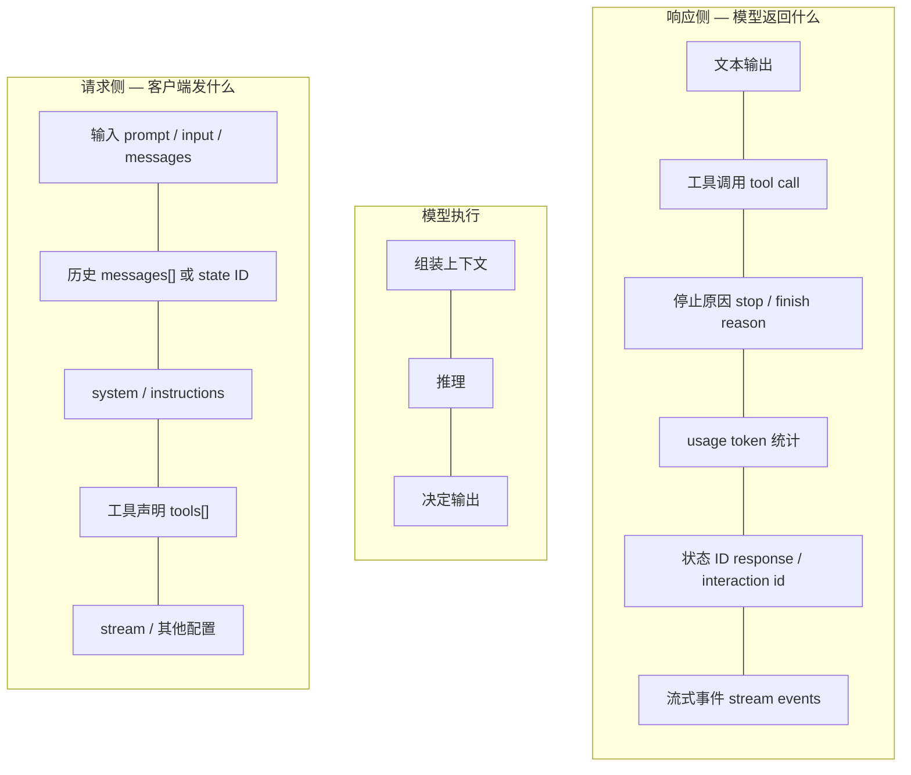

梳理一下主流 LLM 接口的请求/响应结构、调用模式，以及各协议的差异，方便选型和对接时快速对照。





## 不同 API 对照表 — 云端 LLM 厂商原生接口

| 功能            | 请求侧结构                           | 响应侧结构                     | OpenAI Completions<br>(更早的遗留接口) | OpenAI Chat Completions<br>(OpenAI 经典聊天) | OpenAI Responses<br>(OpenAI 新一代)      | Anthropic Messages<br>(Anthropic / Claude 系) | Gemini GenerateContent<br>(Gemini 原生稳定)        | Gemini Interactions<br>(Gemini 状态化 Agentic)    |
| ------------- | ------------------------------- | ------------------------- | ------------------------------- | ---------------------------------------- | ------------------------------------- | -------------------------------------------- | ---------------------------------------------- | ---------------------------------------------- |
| Endpoint / 方法 | URL path 或 SDK method           | URL path 或 stream method  | `/v1/completions`               | `/v1/chat/completions`                   | `/v1/responses`                       | `/v1/messages`                               | `:generateContent` / `models.generate_content` | `/v1beta/interactions` / `interactions.create` |
| 单轮生成          | `prompt` / `input` / `contents` | text / message            | `prompt`                        | `messages`                               | `input`                               | `messages`                                   | `contents`                                     | `input`                                        |
| 多轮对话          | 历史数组或状态 ID                      | 下一轮 assistant/model 输出    | ✗<br>**手动拼 prompt**             | `messages[]`<br>客户端自己维护                  | `input[]` 或 state                     | `messages[]`                                 | `contents[]`                                   | `previous_interaction_id`                      |
| system prompt | system / instructions 字段        | 通常不单独返回                   | ✗<br>手动拼 prompt                 | `role=system/developer`                  | `instructions`                        | 顶层 `system`                                  | `system_instruction`                           | instruction/config 类字段                         |
| 角色区分          | message/content role            | assistant/model role      | ✗                               | `system/user/assistant/tool`             | item role                             | `user/assistant`                             | `user/model`                                   | interaction role/items                         |
| 多模态输入         | block / part / item             | text 或结构化输出               | ✗                               | 部分支持                                     | content items                         | content blocks                               | `parts[]`                                      | 支持多模态 input                                    |
| 结构化输出         | schema / response format        | JSON text / parsed object | 弱<br>靠 prompt                   | `response_format`                        | structured output                     | JSON/tool 方式                                 | `response_schema`                              | 支持结构化输出能力                                      |
| 流式生成          | `stream` 或 stream endpoint      | SSE / chunk / events      | `stream` + SSE                  | `stream` + SSE `delta`                   | response stream events                | `stream` + content events                    | `streamGenerateContent`                        | interaction streaming                          |
| 工具声明          | `tools[]` / declarations        | 模型可见工具 schema             | ✗                               | `tools`                                  | `tools`                               | `tools`                                      | function declarations                          | tools / MCP                                    |
| 工具调用          | 响应返回 tool call                  | tool call item/block      | ✗                               | `tool_calls`                             | output tool call items                | `tool_use` block                             | `functionCall` part                            | tool/function events                           |
| 工具结果回填        | 下一轮带 tool result                | 模型继续回答                    | ✗                               | `role=tool`                              | tool result item                      | `tool_result`                                | `functionResponse`                             | tool result/input item                         |
| 服务端状态         | state/thread/response id        | 返回新 state id              | ✗                               | ✗<br>客户端维护                               | `previous_response_id` / conversation | ✗，通常客户端维护                                    | ✗，SDK chat 多为客户端/SDK history                   | `Interaction` + `previous_interaction_id`      |
| 长任务 / 后台任务    | background / async              | task/run/interaction id   | ✗                               | ✗                                        | background / async 能力                 | ✗                                            | ✗                                              | 支持后台/长任务方向                                     |
| 实时语音/视频       | WebSocket / WebRTC session      | audio/text/tool events    | ✗                               | ✗                                        | 另用 Realtime                           | ✗                                            | 另用 Live API                                    | 另用 Live / interaction 能力                       |

## 五种基本调用模式

### 单轮文本生成

```text
Client ──request──> LLM Server ──response──> Client 显示
```

### 多轮对话（客户端维护历史）

```text
Client 本地保存 history
  │  messages: [user, assistant, user]
  ▼
LLM Server
  │  {role: assistant, content: "..."}
  ▼
Client append 到本地 history
```

### 多轮对话（服务端维护状态）

```text
第一次:
  Client ──{input: "我叫 Alice"}─────────────────────> Server
  Server ──{response: "好的，记住了", response_id: "resp_123"}─> Client

第二次（带上 response_id，服务端自动找回上下文）:
  Client ──{input: "我叫什么？", previous_response_id: "resp_123"}──> Server
  Server ──{response: "你叫 Alice"}───────────────────────────────> Client
```

### 工具调用闭环

```text
Client
  │  {input: "查 AAPL 价格", tools: [get_stock_price]}
  ▼
LLM Server
  │  {tool_call: get_stock_price("AAPL"), id: "call_1"}
  ▼
Client 执行工具
  │  {tool_result: call_1, "AAPL = 189.32"}
  ▼
LLM Server
  │  {output_text: "AAPL 最新价格是 189.32"}
  ▼
Client 显示结果
```

### 流式生成

```text
Client
  │  {stream: true}
  ▼
LLM Server
  │  event "这" ──> event "是" ──> event "一段" ──> event done
  ▼
Client 边收边显示
```

## 本地/托管协议支持

| 框架               | 支持的 API 类型                                                   |
| ---------------- | ------------------------------------------------------------ |
| Bedrock Converse | AWS 统一 Converse 协议（兼容 messages / tool use 模式）                |
| Ollama native    | 自有 `/api/generate`（单轮）+ `/api/chat`（多轮）                      |
| llama.cpp        | OpenAI-compatible `/v1/chat/completions` / `/v1/completions`（通过中间层如 Litellm 可兼容 Anthropic 等格式） |
